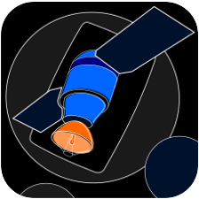

# SatLink



SatLink is a python based application that runs speciffic satellite downlink calcullations. It has a GUI and his main functions are:

  - Atmospheric attenuation calcullation (via [itur])
  - Single and multi-point downlink avaiability calcullation (input and output csv file)
  - Save and load parameters for satellites, ground stations and reception characteristics
  - Totally free !!!

This project is a attempt to simplify satellite's link budget calcullations and to create a tool for teaching purposes. 

# GUI Interface
For those that dont like code writing


  - Simple Qt Gui made for simple usage
  - Drop lists can be edited via model folder

To run the calcullations via GUI interface, just run the python file **main_window.py**. The main window will appear. Now, just choose the functions in the action menu

Detailed information about the usage of the GUI can be found in the [READMEFILE]

# Using SatLink via python commands 
 SatLink consists of three main classes 
 
  - Satellite class
  - Ground Station class
  - Reception class

You need to define those three objects and set their relationship
```sh
# creating the objects
station = GroundStation(site_lat, site_long)
sat = Satellite(sat_long, freq, eirp_max, hsat, b_transponder, b_util, _, _, mod, rolloff, fec)
receptor = Reception(ant_size, ant_eff, coupling_loss, polarization_loss, lnb_gain, lnb_noise_temp, cable_loss, desfoc_max)

# relating the objets to the satellite
sat.set_grstation(station)
sat.set_reception(receptor) 

# example - calcullating the link availability
availability = sat.get_availability()
print(availability)  # 0 - 100 percentage

# example - calcullating the power flux density in the reception point and the antenna noise in rain conditions
pw_flx = sat.get_power_flux_density()
print(pw_flx)  # watts/m²
ant_noise = sat.reception.get_antenna_noise_rain()
print(ant_noise)  # Kelvin
```

The other functions are detailed in the [READMEFILE]

### Libraries

SatLink uses a bunch of differente open source python libraries

* [itur] - A python implementation of the ITU-R P. Recommendations to compute atmospheric attenuation in slant and horizontal paths
* [pyqt] - PyQt is a set of Python bindings for The Qt Company's Qt application framework
* [tqdm] - Instantly make your loops show a smart progress meter
* [pathos] - It provides a consistent high-level interface for configuring and launching parallel computations across heterogeneous resources.
* [pandas] - Fast, powerful, flexible and easy to use open source data analysis and manipulation tool
* [astropy] - Common core package for Astronomy in Python and foster an ecosystem of interoperable astronomy packages
* [numpy] - The fundamental package for scientific computing with Python

### Installation

SatLink is currently tested only in python 3.
Just copy all the folders and files to any directory and make sure all packages are installed. To install the packages, just run the following commands

```sh
pip install itur
pip install tqdm
pip install pandas
pip install pathos
pip install astropy
pip install pyqt5
```

### Contributions

Since this is still a early version of the cody, we expect there some problem can be found, We are tottaly open for contributions and bug/problems reports. **Please tell us!**

### Future Developments

Some updates are planned for the future of the SatLink

* Single and multi-point antenna size calcullation for a given desired availability
* Worst month availabilty calcullation

### Authorship

All the code development was made by Christian Rodrigues.

Contact: christianfragoas@gmail.com

### Credits

[Globo] - For supporting the very first release version of the application

[Caio Alexandre] - Logo designer


[//]: # (These are reference links used in the body of this note and get stripped out when the markdown processor does its job. There is no need to format nicely because it shouldn't be seen. Thanks SO - http://stackoverflow.com/questions/4823468/store-comments-in-markdown-syntax)


   [Globo]: <https://globoplay.globo.com/>
   [itur]: <https://github.com/iportillo/ITU-Rpy>
   [pathos]: <https://github.com/uqfoundation/pathos>
   [tqdm]: <https://github.com/tqdm/tqdm>
   [pandas]: <https://pandas.pydata.org/>
   [astropy]: <https://www.astropy.org/>
   [numpy]: <https://numpy.org/>
   [pyqt]: <https://riverbankcomputing.com/software/pyqt/intro>
   [Caio Alexandre]: <https://www.instagram.com/caioalexandredasilva>   
